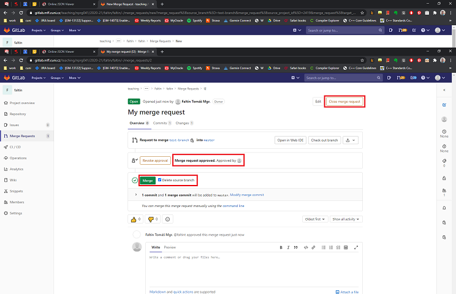

## Obecné
- Přednáška: [link](https://www.ksi.mff.cuni.cz/teaching/nprg041-web/)

## Cvičení
- Středa 15:40
- Zoom
  - **Streamování cvičení**
  - Meeting ID: [973 1735 5782](https://cuni-cz.zoom.us/j/97317355782)
  - Heslo na přihlášení je v modulu SISu Nástěnka
- Slack
  - **Kanál cvičení s informacemi**
  - workspace:`parg-mff.slack.com`, channel:`#nprg041-cpp-faltin`
  - Odkaz na přihlášení je v modulu SISu Nástěnka
- Recodex: [link](https://recodex.mff.cuni.cz/)
  - **Zadání a odevzdání 2 velkých úkolů**
    - 1. domácí úkol - **deadline 20.12. 23:59**
- Gitlab: [link](https://gitlab.mff.cuni.cz/)
  - **Odevzdávání ostatních úkolů a zápočťáku**
  - Přihlášení pomocí CAS (MFF login), např. `novakk` pro Karla Nováka
  - Poté dostanete přístup do repository: `teaching/nprg041/2020-21/faltin/XXXX`
  - Práce s Gitlabem (viz dole)
- MS Stream: [link](https://web.microsoftstream.com)
  - **Nahrávky přednášek a cvičení**
  - Přihlášení pomocí CAS čísla, např. `123456789@cuni.cz`

### Před prvním cvičení
- Nainstalovat + přihlásit se na Zoom, Slack
- Nainstalovat/připravit si nějaké vývojové prostředí
  - Microsoft Visual Studio
  - Clion
  - Visual Studio Code + překladač
  - ... 

### 1. cvičení (30.9.)
- prezentace: [pptx](data/2020-21/cpp/ex01_v2.pptx), [pdf](data/2020-21/cpp/ex01_v2.pdf)
- nahrávka: [link](https://web.microsoftstream.com/video/9793e64e-8151-4627-88c4-03dd09671804)
- **DÚ (deadline 5.10. 23:59):** Úkoly 1-4 nahrát do svojí složky na Gitlabu

### 2. cvičení (7.10.)
- prezentace: [pptx](data/2020-21/cpp/ex02_v1.pptx), [pdf](data/2020-21/cpp/ex02_v1.pdf)
- nahrávka: [link](https://web.microsoftstream.com/video/a3a8de9a-d91f-4a05-a0f2-2484d63ea52a)
- **DÚ (deadline 12.10. 23:59):** Matice pro čísla (nahrát do Gitlab + vytvořit merge request)

### 3. cvičení (14.10.)
- prezentace: [pptx](data/2020-21/cpp/ex03_v2.pptx), [pdf](data/2020-21/cpp/ex03_v2.pdf)
- nahrávka: [link](https://web.microsoftstream.com/video/9d7e6321-0e48-4f8d-8127-92849b0a58bc)
- **DÚ (deadline 19.10. 23:59):** Úkoly 1-2 (třída C, třída pro komplexní čísla)

### 4. cvičení (21.10.)
- prezentace: [pptx](data/2020-21/cpp/ex04_v1.pptx), [pdf](data/2020-21/cpp/ex04_v1.pdf)
- nahrávka: [link](https://web.microsoftstream.com/video/f26699e5-67fe-4763-b720-ff4ea01f9e01)
- **DÚ (deadline 26.10. 23:59):** Piškvorky pro 2 hráče

### 5. cvičení (28.10.)
- **státní svátek: **Den vzniku samostatného československého státu

### 5. cvičení (4.11.)
- prezentace: [pptx](data/2020-21/cpp/ex05_v2.pptx), [pdf](data/2020-21/cpp/ex05_v2.pdf)
- nahrávka: [link](https://web.microsoftstream.com/video/90ebd6f5-b9a9-4859-a81f-1ba39d5b2a3d)
- **DÚ (deadline 9.11. 23:59):** implementace `std::vector<int>` a základních funkcí pomocí dynamické alokace

### 6. cvičení (11.11)
- prezentace: [pptx](data/2020-21/cpp/ex06_v2.pptx), [pdf](data/2020-21/cpp/ex06_v2.pdf)
- nahrávka: [link](https://web.microsoftstream.com/video/64160046-4792-4a36-a7a7-ecc81c6a9800)
- cvičení: Hledání chyb - [zadání](data/2020-21/cpp/ex06-matrix.cpp)/[řešení](data/2020-21/cpp/ex06-matrix_solution.cpp)
- **DÚ (volitelně):** databáze lidí

### 7. cvičení (18.11)
- prezentace: [pptx](data/2020-21/cpp/ex07_v3.pptx), [pdf](data/2020-21/cpp/ex07_v3.pdf)
- nahrávka: [link](https://web.microsoftstream.com/video/1e4dbb4f-494d-47ef-9061-04cf03441bc6)
- cvičení: zadání 1. domácího úkolu, dědičnost
- **DÚ (deadline 23.11. 23:59):**: Polymorfní vector
- **1. VELKÝ DÚ (deadline 20.12. 23:59):**: Agregátor dat (v Recodexu)

## Často opakované chyby/doporučené postupy
- Často opakované chyby a doporučené postupy, na které se dá ve **většině** případů spolehnout

### Obecné
1. zapněte si zobrazování všech warnings a odstraňte je
2. konstanty
- v kódu by se neměly jen tak vyskytovat konstanty/literály
```
Co je 12? Proč zrovna 12 a ne 13? Není zřejmé bez toho, aniž by člověk četl tělo cyklu
for (int i = 0; i < 12; ++i) { ... }

:) 
const int ARRAY_LENGTH = 12;
for (int i = 0; i < ARRAY_LENGTH; ++i) { ... }

:)) 
for (int i = 0; i < array.size(); ++i) { ... }

:))) "range-based" iteraci, pokud to jde
for (auto &&element : array) { ... }
```

3. špatná jména proměnných/funkcí/tříd: `x`, `tmp`, `i`
```
:(
for (int i = 0; i < matrix.width(); ++i) {
  for (int j = 0; j < matrix.height(); ++j) {
    ...
  }
}

:)
for (int width_idx = 0; width_idx < matrix.width(); ++width_idx) {
  for (int height_idx = 0; height_idx < matrix.height(); ++height_idx) {
    ...
  }
}
```

### Specifická pro C++ 
1. funkce, která pouze čte (ale nemění obsah), by měla být `const`
```
:(
class Complex {
  double real_part, imaginary_part;
public:
  void print() { std::cout << '[' << real_part << ',' << imaginary_part << ']'; }
  double real() { return real_part; }
};

:)
class Complex {
  double real_part, imaginary_part;
public:
  void print() const { std::cout << '[' << real_part << ',' << imaginary_part << ']'; }
  double real() const { return real_part; }
};
```

2. Používat pro inicializaci "member initializer list"
- https://en.cppreference.com/w/cpp/language/constructor
```
:(
class Complex {
  double real_part, imaginary_part;
public:
  Complex(real re, imaginary_part im) { real_part = re; imaginary_part = im; }
};

:)
class Complex {
  double real_part, imaginary_part;
public:
  Complex(real re, imaginary_part im) :real_part{re}, imaginary_part{im} {}
};
```

3. Nepředávat velké objekty hodnotou, ale referencí
```
:(
bool all_same(Complex number1, Complex number2, Complex number3);

:)
bool all_same(const Complex &number1, const Complex &number2, const Complex &number3);
```

## Práce s Gitlabem
- Stahněte si nějakého roumného GIT klienta (např. TortoiseGit na Windows). Samozřejmě je možné ovládat GIT i z příkazové řádky. 
- Nahrávejte pouze zdrojové, konfigurační, projektové a datové soubory (soubory, z kterých jde program přeložit (zdrojáky) ve vašem IDE (konfigurační a projektové soubory) a otestovat (datové soubory)
  - Ne: `*.obj`, `*.tmp`, `*.pdb`, ...
  - Pokud nevíte, zkuste pogooglit: `gitignore ...`, např. `gitignore Visual Studio`

### (Doporučený) Postup práce
- `master` je hlavní branch (větev) ve vašem repository. Měla by obsahovat všechnu vaši ukončenou-výstavní práci. Když začínáte pracovat na novém projektu (úkolu), vytvořte si novou větev, do té ukládejte změny
a když je vše odladěno, otestováno tak větev zamergeujte do `master` větve. Pokud je to pouze pro vás, můžete to udělat lokálně přes vašeho GIT klienta, pokud se chcete o své výsledky podělit s vyučujím/kamarády, 
vytvořte merge request (viz níže). 

### Jak na merge request 
Preferovaný postup je verze 1, ale pokud už jste změny vložili do masteru, tak zvolte verzi 2

#### Verze 1: mám speciální branch s úkolem/projektem
- Mám branch (větev), kde mám uložené změny z úkolu (commit + push). Ty změny by měly být novější než v `master`u.
1. Otevřu svojí repository v Gitlabu, vyberu větev, z které chci dělat merge request a stisknu tlačítko `Create merge request`


2. Zvolte rozumný název, jako `Assignee` zvolte člověka, který má kontrolovat merge request, v záložkách `Commits`/`Changes` byste měli vidět změny, které se budou kontrolovat. Pokud je vše v pořádku, zvolte `Submit merge request`.


3. Merge request je vytvořený. Až úkol zkontroluji, tak ho označím jako `Approved` a pak už s ním můžete dělat, jak uznáte za vhodné. Doporučený postup je `Merge` zmíněnou větev do masteru (automaticky si větev zamerguje, 
pokud tam nejsou žádné konflikty) a zavřít merge request. 



#### Verze 2: úkol mám v masteru (TBD)
- Změny/úkol mám nahrané v `master` větvi.
1. Vytvořím `tag` na daném commitu.
2. Vytvořím novou větev z daného tagu
3. Vytvořím merge request z `master` větve do nově vytvořené větve (obrácené než v prvním případě)


