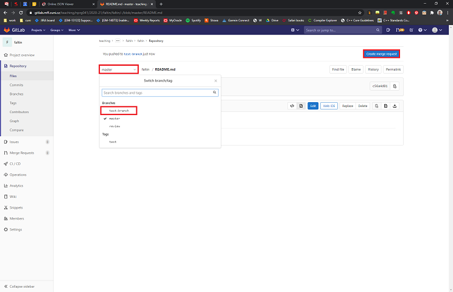
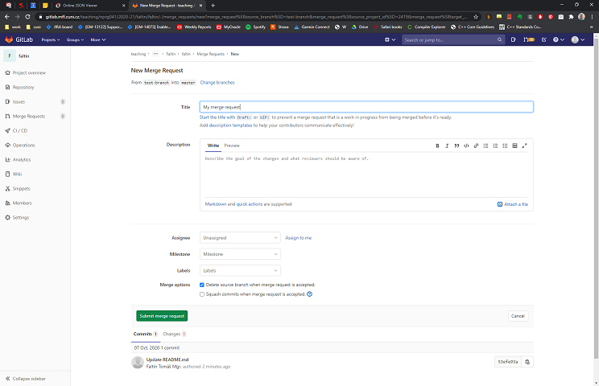

## Obecné
- Přednáška: [link](https://www.ksi.mff.cuni.cz/teaching/nprg041-web/)

## Cvičení
- Středa 15:40
- Zoom
  - **Streamování cvičení**
  - Meeting ID: [973 1735 5782](https://cuni-cz.zoom.us/j/97317355782)
  - Heslo na přihlášení je v modulu SISu Nástěnka
- Slack
  - **Kanál cvičení s informacemi**
  - workspace:`parg-mff.slack.com`, channel:`#nprg041-cpp-faltin`
  - Odkaz na přihlášení je v modulu SISu Nástěnka
- Recodex: [link](https://recodex.mff.cuni.cz/)
  - **Zadání a odevzdání 2 velkých úkolů**
- Gitlab: [link](https://gitlab.mff.cuni.cz/)
  - **Odevzdávání ostatních úkolů a zápočťáku**
  - Přihlášení pomocí CAS (MFF login), např. `novakk` pro Karla Nováka
  - Poté dostanete přístup do repository: `teaching/nprg041/2020-21/faltin/XXXX`
  - Doporučení
    - Nainstalujte a vyzkoušejte si nějakého rozumného GIT klienta (např. TortoiseGit na Windows)
    - Nahrávejte pouze zdrojové, konfigurační, projektové a datové soubory!  
- MS Stream: [link](https://web.microsoftstream.com)
  - **Nahrávky přednášek a cvičení**
  - Přihlášení pomocí CAS čísla, např. `123456789@cuni.cz`
  
### Před prvním cvičení
- Nainstalovat + přihlásit se na Zoom, Slack
- Nainstalovat/připravit si nějaké vývojové prostředí
  - Microsoft Visual Studio
  - Clion
  - Visual Studio Code + překladač
  - ... 

### 1. cvičení (30.9.)
- prezentace: [pptx](data/2020-21/cpp/ex01_v2.pptx), [pdf](data/2020-21/cpp/ex01_v2.pdf)
- nahrávka: [link](https://web.microsoftstream.com/video/9793e64e-8151-4627-88c4-03dd09671804)
- **DÚ (deadline 5.10. 23:59):** Úkoly 1-4 nahrát do svojí složky na Gitlabu

### 2. cvičení (7.10.)
- prezentace: [pptx](data/2020-21/cpp/ex02_v1.pptx), [pdf](data/2020-21/cpp/ex02_v1.pdf)
- nahrávka: [link](https://web.microsoftstream.com/video/a3a8de9a-d91f-4a05-a0f2-2484d63ea52a)
- **DÚ (deadline 12.10. 23:59):** Matice pro čísla (nahrát do Gitlab + vytvořit merge request)

## Jak na merge request 
Preferovaný postup je verze 1, ale pokud už jste změny vložili do masteru, tak zvolte verzi 2
### Verze 1: mám speciální branch s úkolem
0. Mám branch (větev), kde mám uložené změny z úkolu (commit + push). Ty změny by měly být novější než v `master`u.
1. Otevřu svojí repository v Gitlabu, vyberu větev, z které chci dělat merge request a stisknu tlačítko `Create merge request`

2. Zvolte rozumný název, jako `Assignee` zvolte mě, v záložkách `Commits`/`Changes` byste měli vidět změny, které se budou review-ovat. Pokud je vše v pořádku, zvolte `Submit merge request`.

3. Merge request je vytvořený. Až úkol zkontroluji, tak ho označím jako `Approved` a pak už s ním můžete dělat, jak uznáte za vhodné. Doporučený postup je `Merge` zmíněnou větev do masteru (automaticky si větev zamerguje, 
pokud tam nejsou žádné konflikty) a zavřít merge request. 

### Verze 2: úkol mám v masteru
0. Změny/úkol mám nahrané v `master`u
TBD

